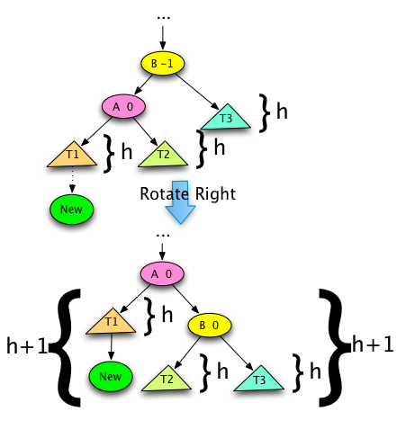
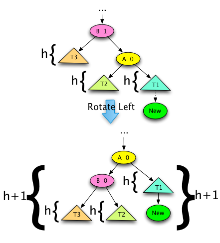

## Goals

- History
- Definition
- Implementation
- Insertion
- Rotation
- Removal

## History

- AVL tree was invented in 1962 by two soviet mathematicians, Georgy **A**delson-**V**elsky and Engenii **L**andis
- It was the first data structure of this kind (self-balancing tree)
- It is mathematically related to the _red-black tree_

## Definition

- The _height_ of a tree is one plus the maximum height of its subtrees
- The height of a leaf node is one.
- The _balance_ of a node in a binary tree is $height(right subtree)-height(left subtree)$
- An _AVL tree_ is a binary tree in which the balance of every node in the tree is −1, 0, or 1
- In other words, the heights of the two subtrees of any node differ by at most one

## Implementation

- Iterative (stack-based)
- Recursive
- Maintaining node balance
- Maintaining node height

### Class AVL Tree

```python
class AVLTree:
    class AVLNode:
        def __init__(self, item, balance=0, left=None, right=None):
            self.item = item
            self.left = left
            self.right = right
            self.balance = balance

        def __repr__(self):
            return f"AVLTree.AVLNode({repr(self.item)}, balance={repr(self.balance)}, left={repr(self.left)}, right={repr(self.right)})"
```

## Insertion

### BinarySearchTree

```python
def _insert(self, root, val):
    if root is None:
        return BinarySearchTreeNode(val)
    if val < root.value:
        root.left = BinarySearchTree._insert(self, root.left, val)
    else:
        root.right = BinarySearchTree._insert(self, root.right, val)
    return root
```

### Iterative Insertion

- Keep track of the _path stack_ to the new node
- After the new element has been inserted, start popping items from the stack
- If the popped node has balance of $0$, adjust it (if necessary) to $1$ or $-1$
- If the popped node's balance is not $0$, declare this node the _pivot_ and consider 3 mutually exclusive cases

### Case 1. No Pivot (before)

The balance of each node along the path is $0$


### Case 1. No Pivot (after)

Adjust balance of each node in the stack path


### Case 2. No rotation (before)

The pivot node exists and the new node was added to a **shorter** subtree of the pivot


### Case 2. No rotation (after)

Adjust balance of each node in the stack path up to the pivot


### Case 3

- The pivot node exists and the new node was added to its **taller** subtree, causing the balance of the pivot to become $+2$ or $-2$ after adjustment.
- The child of the pivot in the direction (left or right) of _imbalance_ is the _bad child_.
- Solution involves some combination of left (counter-clockwise) and right (clockwise) _rotation_

### Case 3a. Single rotation (before)

New node is added to the subtree of the bad child and the direction of imbalance


### Case 3a. Single rotation (after)

Perform a rotation at the pivot in the direction **opposite** of the imbalance


### Case 3b. Double rotation (before)

New node is added to the subtree of the bad child and the direction **opposite** of imbalance. A _bad grandchild_ is a child of the bad child that lies on the path.


::: notes

Bad grandchild may not exist

:::

### Case 3b. Double rotation (intermediate)

Perform a rotation at the bad child in the direction of imbalance


### Case 3b. Double rotation (after)

Perform a rotation at the pivot in the direction **opposite** of the imbalance


## Rotations

### Right (clockwise) rotation



### Left (counter-clockwise) rotation



## Example


::: notes

Wikipedia

:::

## Removal

- Remove a node and check adjust balance of each node on the path stack
- If the adjusted balance of a node on the path is $+2$ (skewed to the right), perform left rotation
- If the adjusted balance of a node on the path is $-2$ (skewed to the left), perform right rotation

## Summary

- History
- Definition
- Implementation
- Insertion
- Rotation
- Removal

## Thank you

Got questions?

## References

- [Data Structures and Algorithms with Python by Kent Lee and Steve Hubbard](https://dl.acm.org/citation.cfm?id=2732680)
- Адельсон-Вельский Г. М., Ландис Е. М. Один алгоритм организации информации //Доклады АН СССР, 146 (1962), 263-266
- [AVL tree - Wikipedia](https://en.wikipedia.org/wiki/AVL_tree)
- [VisuAlgo - Binary Search Tree, AVL Tree](https://visualgo.net/en/bst)
