## Goals

* Database background
* B-Tree organization
* B-Tree implementation
* B-Tree operations

## Database background

### Database design

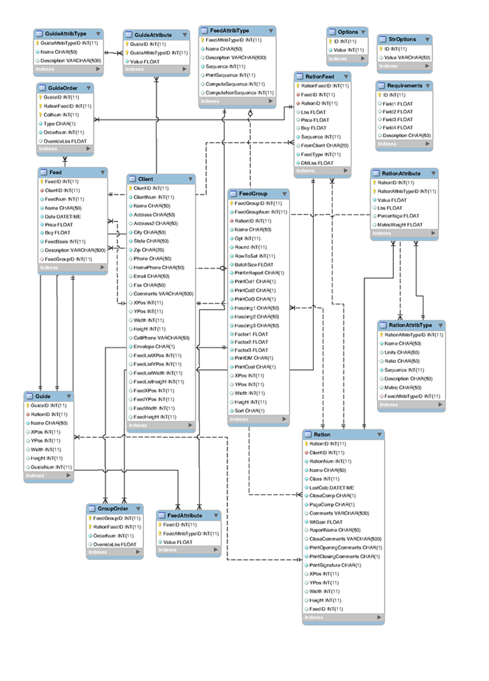

::: notes

<http://knuth.luther.edu/~leekent/CS2Plus/chap10/chap10.html#figures-from-text>

:::

### Relational database

* Many *relations* (entities) connected via *relationships*
* Represented as an *LDS* or an *ERD*
* Relationships could be: *1-1*, *1-M*, *M-M*
* *M-M* relationships must be *reified* for the schema to work properly
* Schema should be *normalized* to remove functional dependencies
* Reification and normalization yield new entities
* Data can be retrieved from tables using *join* operation

### Textbook example

* Relation *Feed* contains items like corn silage and alfalfa
  * Those items are composed of many nutrients
* Relation *FeedAttribType* contains nutrients (calcium, iron, sugar etc)
  * Those nutrients can be part of many feeds
* Relation *FeedAttribute* is used to reify many-many relationship between feed and nutrient
* *FeedAttribute* adds the value for the quantity

### Textbook example LDS

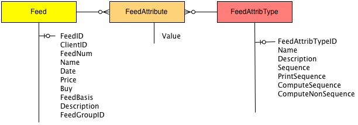

### Challenge

```sql
select Feed.FeedNum, Feed.FeedName, FeedArribType.Name, FeedAttribute.Value
from Feed, FeedAttribute, FeedAttribType
where Feed.FeedID = FeedAttribute.FeedID and FeedAttribute.FeetAttribTypeID = FeetAttribType.FeetAttribTypeID
```

### Database organization

* Each relation (table) is stored as a separate file
* Joining tables means reading 2 files
  * In the worst case, sequentially
* Data can be stored in increasing order (of the key)
  * Parts of a file can be accessed directly using Python's `seek` function
* Big question: **are tables always ordered?**

::: notes

<http://knuth.luther.edu/~leekent/CS2Plus/chap10/chap10.html#the-inefficient-join-program>

:::

### Database index

* A structure that allows efficient lookup time on any record in the table
* Implementation details are left up to a specific DBMS

### B-Tree history

* Invented by Rudolf Bayer and Edward McCreight
* Bayer also invented *red-black tree* in 1972
* The meaning of **B** is unknown (could be Boeing, balanced, Bayer)

::: notes

"The more you think about what the B in B-trees means, the better you understand B-trees."

--McCreight

:::

## B-Tree organization

### Properties

* Balanced tree that consists of nodes
  * Each node is a combination of pointers and items
  * All *leaf* nodes are at the same level
* The *degree* of a tree is the minimum number of items that a node can contain
  * except the root
* The *capacity* is the maximum number of items that a node can contain
  * $capacity = 2 \times degree$

### Properties. Continued

* Items in a node are stored in order (increasing or decreasing) of their *keys*
  * First value in the tuple
  * The second value is the record id (offset within a file)
* A pointer to the **left** of an *item* points to a node with smaller items
* A pointer to the **right** of an *item* points to a node with larger items

### B-Tree example

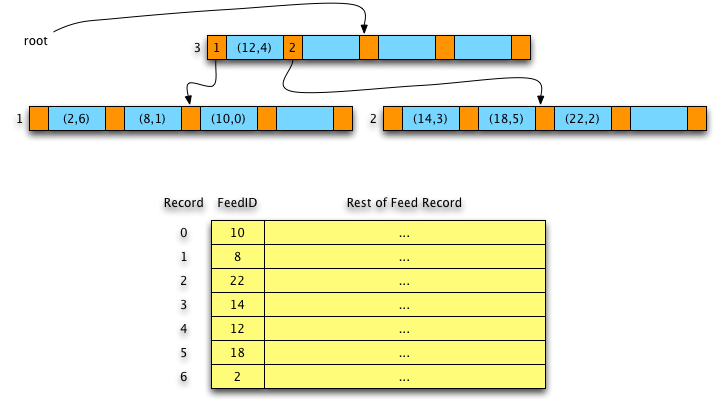

### B-Tree advantages

* Multiple indices can be built on a single table
* $O(\log_d{n})$ lookup, where $d$ is the degree of the tree and $n$ is the number of items
* Ordered **sequential** access to the index, as opposed to hashing
* Suitable to store **very large** amounts of data
* As a tree gets wider, access time improves
* Index itself can be a file
* Record can be removed from the tree (index) without rewriting the file (table)
* Tree (index) does not have to be rebuilt

## B-Tree implementation

See *btree.py* in the *src/notes/btree/*

## B-Tree operations

* Lookup is similar to other search trees
* Insertion can cause splitting
* Removal may cause rebalancing

## B-Tree Insert

* Find a **leaf node** where the new item belongs
* If there is room in that node, insert an item
* If the node has reached its capacity, split at median item
  * Promote median item to the parent (recursively)
  * All smaller items become left node
  * All greater items become right node

### B-Tree Insert. Tree to build

* Let's built the tree of degree **2**
  * Number of items in each node is **2..4**
* Insert the following items: 10, 8, 22, 14, 12, 18, 2, 50, 15

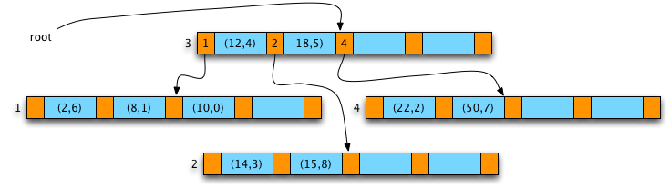

### B-Tree Insert. Step 1: insert 10, 8, 22, 14

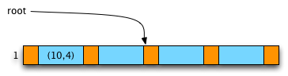

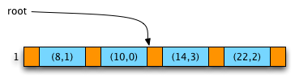

### B-Tree Insert. Step 2: insert 12

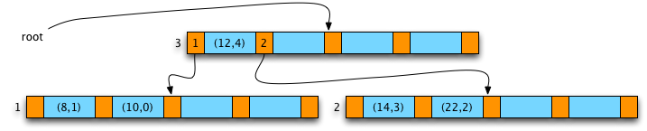

### B-Tree Insert. Step 3: insert 18, 2, 50

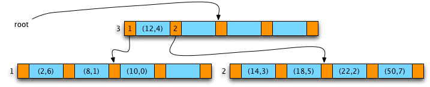

### B-Tree Insert. Step 4: insert 15


## B-Tree Delete

* Find the **item** and its **node**
* If the node is a leaf and has more than *degree* items, delete
  * If fewer than *degree* items, rebalance
* If the node is not a leaf, take the smallest item from the right subtree
  * Or the largest item from the left subtree
  * If this causes some node to have fewer than *degree* items, rebalance

### B-Tree Rebalancing

* If either left or right **sibling** has extra items
  * Borrow from that sibling
  * Rotate items as necessary (left or right)
* If there is no immediate sibling to borrow from
  * Merge the node, its sibling, and the separating parent item into a new node

### B-Tree Delete. Initial tree


### B-Tree Delete. Step 1: Delete 14

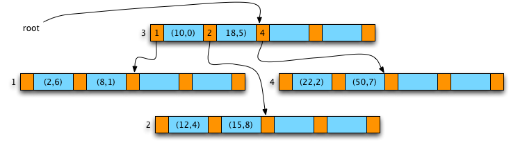

### B-Tree Delete. Step 2: Delete 50

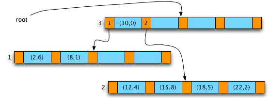

### B-Tree Delete. Step 3: Delete 8


### B-Tree Delete. Step 4: Delete 12

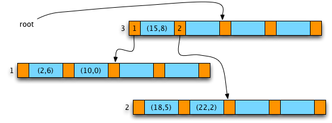

### B-Tree Delete. Step 5: Delete 18

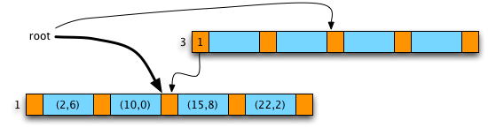

## Summary

* Database background
* B-Tree organization
* B-Tree implementation
* B-Tree operations

## Thank you

Got questions?

## References

* [Data Structures and Algorithms with Python by Kent Lee and Steve Hubbard](https://dl.acm.org/citation.cfm?id=2732680)
* [B-tree - Wikipedia](https://en.wikipedia.org/wiki/B-tree)
* [Organization and maintenance of large ordered indexes | SpringerLink](https://link.springer.com/article/10.1007%2FBF00288683)
