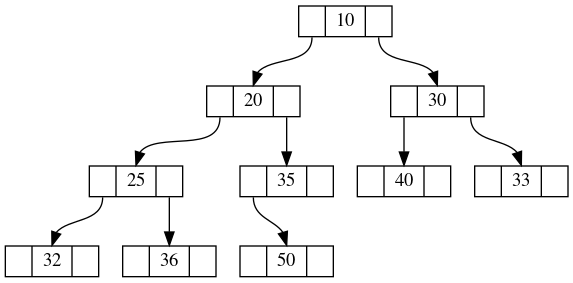

## Goals

* Binary heap analysis
* Binary heap implementation
* Build a binary heap
* Remove an element
* Add a new element

## Binary heap

A data structure used when it's necessary to repeatedly remove the smallest (largest) item.

Introduced by J. Williams in 1964, as a data structure for the *heapsort*

## Analysis

Assuming min-heap

| Operation        | Time complexity  |
| ---------------- | ---------------- |
| building         | $O(n)$           |
| find-min (peek)  | $\Theta(1)$      |
| delete-min (pop) | $\Theta(log(n))$ |
| insert (push)    | $O(log(n))$      |
| decrease-key     | $O(log(n))$      |
| meld (merging)   | $\Theta(n)$      |

## Implementation

Using an array (list) guarantees $O(1)$ access to a node and its children / parent

```python
[10, 20, 30, 25, 35, 40, 33, 32, 36, 50]
```



## Build binary heap

* Build by insertion ($O(n\times log(n))$)
* Heapify ($O(n)$)

### Heapify

1. Treat an array as a heap and percolate root of the last subtree down.
2. Continue for other sub-roots until done

### Implementation of `heapify`

```python
def heapify(self, not_a_heap):
    """Build a heap from any list"""
    self._heap = not_a_heap[:]
    cur_idx = len(self._heap) // 2 - 1
    while cur_idx >= 0:
        self._perc_down(cur_idx)
        cur_idx = cur_idx - 1
```

### Implementation of `_perc_down`

```python
def _perc_down(self, cur_idx):
    """Move a node down"""
    while 2 * cur_idx + 1 < len(self._heap):
        min_child_idx = self._get_min_child(cur_idx)
        if self._heap[cur_idx] > self._heap[min_child_idx]:
            self._heap[cur_idx], self._heap[min_child_idx] = (
                self._heap[min_child_idx],
                self._heap[cur_idx],
            )
        else:
            return
        cur_idx = min_child_idx
```

## Insertion

### Implementation of `_perc_up`

```python
def _perc_up(self, cur_idx):
    """Move a node up"""
    while (cur_idx - 1) // 2 >= 0:
        parent_idx = (cur_idx - 1) // 2
        if self._heap[cur_idx] < self._heap[parent_idx]:
            self._heap[cur_idx], self._heap[parent_idx] = (
                self._heap[parent_idx],
                self._heap[cur_idx],
            )
        cur_idx = parent_idx
```

## Summary

* Binary heap has $\Theta(1)$ *root* retrieval
* Used in heapsort, Dijkstra's, and Prim's algorithms
* Priority queue

## Thank you

Got questions?

## References

* [Data Structures and Algorithms with Python by Kent Lee and Steve Hubbard](https://dl.acm.org/citation.cfm?id=2732680)
* [cpython/heapq.py at 3.7 · python/cpython](https://github.com/python/cpython/blob/3.7/Lib/heapq.py)
* [Algorithm Repository](http://algorist.com/problems/Priority_Queues.html)
* [Binary heap - Wikipedia](https://en.wikipedia.org/wiki/Binary_heap)
