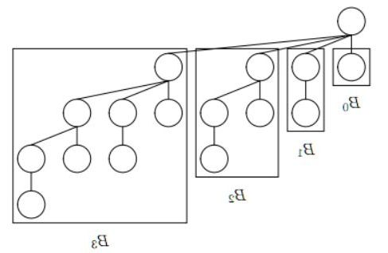
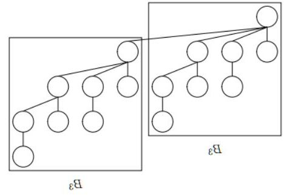

## Goals

* Binomial tree
* Binomial queue
* Implementation
* Merging
* Insertion
* Removal

## Binomial tree

General tree with no fixed *degree*

### Binomial tree definition

A binomial tree of order $k\ge0$ with root $R$ is the tree $B_k$ defined as follows:

1. If $k = 0$, $B_k$ = $B_0$ = $\{R\}$, that is it consists of a single node, $R$
2. If $k \ge 0$, $B_k = \{R, B_{k-1}, B_{k-2}, ..., B_1, B_0\}$

### First 4 binomial trees

### Binomial tree properties

* $B_k$, a binomial tree of order $k$, has *height* of $k$
* $B_k$, a binomial tree of order $k$, has *degree* of $k$
* $B_k$, a binomial tree of order $k$, contains $2^k$ nodes
* Number of nodes at level $d$ in a tree of order $k$ is ${{k}\choose{d}} = \frac{k!}{d!(k-d)!}$, the binomial coefficient

::: notes

Binomial theorem was discovered (proof not published) by Isaac Newton in 1676, proved incorrectly by Lenhard Euler in 1774, and proved for the first time by Karl Friedrich Gauss in 1812.

:::

### Binomial tree of order 4 (view 1)

### Binomial tree of order 4 (view 2)

## Binomial heap (queue)

* Invented by Jean Vuillermin in 1978
* Implemented as a *forest* of *binomial trees*
* Offers $O(log(n))$ merging
* Has $O(1)$ (amortized) insertion
* Suffers from $O(log(n))$ retrieval
* Can contain any number of items, not only power of 2
* Forest as a binary representation of $n$

### Binomial heap size

A *forest* of binomial trees is used. The *forest* contains binomial tree $B_i$ if the $i$the bit in the binary representation of $n$ is set to 1.

$F_n = \{B_i : b_i = 1\}$

* $F_{27} = \{B_4, B_3, B_1, B_0\}$
* $F_{10} = \{B_3, B_1\}$
* $F_{37} = \{B_5, B_2, B_0\}$

## Implementation

* Roots of the trees in the forest are connected using a linked list
* Binomial trees are stored in the list in increasing order ($B_0$, $B_1$ etc)
* Two binomial trees of order $k$ can be combined into a single binomial tree of order $k+1$
* A heap of $n$ items has at most $log_2(n + 1)$ trees

## Merging

Add two binary representations of each heap size.

Combine two trees of the lower order, carry over if necessary.

Running time $O(log(n + m))$.

## Insertion

Create a binomial heap of one item and *merge* it into the original one.

Running time $O(1)$.

## Removal

Remove the smallest root and merge the remaining trees (still a binomial tree forest) into the original heap.

Running time $O(log(n))$.

## Summary

* Binomial tree
* Binomial queue
* Implementation
* Merging
* Insertion
* Removal

## Thank you

Got questions?

## References

* [Data Structures and Algorithms with Python by Kent Lee and Steve Hubbard](https://dl.acm.org/citation.cfm?id=2732680)
* [A data structure for manipulating priority queues](https://www.cl.cam.ac.uk/teaching/1011/AlgorithII/1978-Vuillemin-queues.pdf)
* [Binomial heap - Wikipedia](https://en.wikipedia.org/wiki/Binomial_heap)
* [Bruno R. Preiss's books with source](https://www3.cs.stonybrook.edu/~algorith/implement/brpreiss/implement.shtml)
