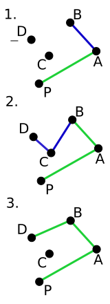

## Goals

- Convex hull
- Gift wrapping
- Graham scan

## Convex hull

- The smallest convex set of points that contains a shape.
- One of the fundamental problems of computational geometry.
- Usually $n$ is the number of points and $h$ is the number of _extreme_ points.
- Can be solved in $O(n\log{n})$ time for 2-dimensional space.
- Output-sensitive complexity of $O(n\log{h})$.

## Algorithms

- Gift wrapping (1970-73) with the complexity of $O(nh)$ and $\Theta(n^2)$ in the worst case.
- Graham scan (1972) with the complexity of $O(n\log{n})$ and $O(n)$ if points are sorted.
- Quickhull (1977-78) with the complexity of $O(n\log{n})$ and $O(n^2)$ in the worst case.
- Kirkpatrick–Seidel algorithm (1986) is an _optimal_ output-sensitive algorithm with the complexity of $O(n\log{h})$.
- Chan's algorithm (1996) is a simpler optimal algorithm with the complexity of $O(n\log{h})$.

### Edge cases

- Collinear (colinear) points must be dealt with:
  - Either include all or exclude midpoints
- Only 1 point in the initial set
- Every point in the set is on the hull
  - Gift wrapping deteriorates to $\Theta(n^2)$
- $\log{n} > h$
  - Graham is worse than Jarvis

## Gift wrapping

1. Pick some point $p_{0}$ on the hull (e.g. leftmost-lowest). Set $i$ to 0, so $i+1$ is 1.
2. Find a point $p_{i+1}$ so that all other points are on the right of the line $p_{i}p_{i+1}$ (initially, $p_0p_1$).
   - compare _polar angles_ of all points with respect to $p_i$
3. Add $p_{i+1}$ to the hull and set $i$ to $i+1$
4. Repeat steps 2-3 until some step $h$ selects $p_{0}$ as $p_{h}$.

### Gift wrapping visualization


::: notes

Source: Wikipedia

:::

## Graham scan

1. Find the lowest-leftmost point ($p_{0}$) in the set ($O(n)$ operation). It is guaranteed to be on the hull.
2. Sort the points in the set by the angle between $p_{0}p_{i}$ and the X axis ($O(n\log{n})$ operation).
3. Starting with $p_{0}$ and $p_{1}$, continue through the sorted list and for each point $p_{i+2}$ determine if getting from $p_{i}p_{i+1}$ to $p_{i+2}$ requires a _left_ or a _right_ turn.
   - in case of a right turn, remove $p_{i+1}$ from the hull and look at points $p_{i-1}p_{i}$ until left turn is found.

### Graham scan visualization



::: notes

Source: Wikipedia

:::

### Left turn vs right turn

With point $P_{1}(x_{1}, y_{1})$, $P_{2}(x_{2}, y_{2})$, and $P_{3}(x_{3}, y_{3})$ calculate z-coordinate of the cross product of two vectors $\overrightarrow {P_{1}P_{2}}$ and $\overrightarrow {P_{1}P_{3}}$ as follows:

$$z = (x_{2}-x_{1})(y_{3}-y_{1})-(y_{2}-y_{1})(x_{3}-x_{1})$$

| Value of $z$ | Meaning                          |
| ------------ | -------------------------------- |
| $z = 0$      | Points are _collinear_           |
| $z < 0$      | "right" or clockwise turn        |
| $z > 0$      | "left" or counter-clockwise turn |

### Graham scan pseudocode

```
let points be the list of points
let stack be an empty stack
let p0 be the lowest-leftmost point

sort points by polar angle with p0
# if several points have the same polar angle, keep the farthest

for point in points:
    # keep popping from the stack until we see a left turn
    while
      size of stack > 1 and
      ccw(next_to_top(stack), top(stack), point) <= 0:
        pop from stack
    push point to stack
end
```

::: notes

Source: Wikipedia

:::

## Summary

- Convex hull
- Gift wrapping
- Graham scan

## Thank you

Got questions?

## References

- [Data Structures and Algorithms with Python by Kent Lee and Steve Hubbard](https://dl.acm.org/citation.cfm?id=2732680)
- [Convex hull - Wikipedia](https://en.wikipedia.org/wiki/Convex_hull)
- [Convex hull algorithms - Wikipedia](https://en.wikipedia.org/wiki/Convex_hull_algorithms)
