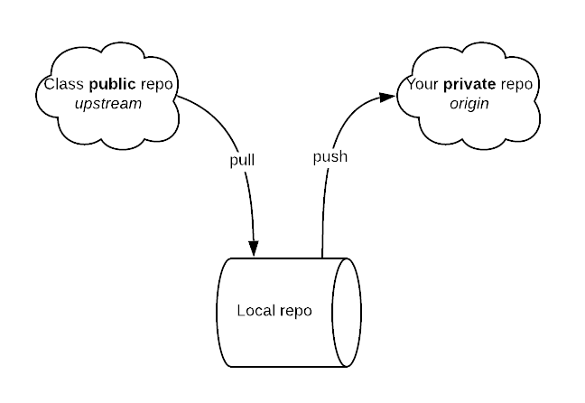

## Overview

### Tools

* Python **3.7**
* `flake8` with `flake8-mypy` plugin
* `black`
* `pytest` with `pytest-timeout` plugin
* `colorama`
* `tkinter`
* `git`

### Course repository

<https://github.com/LutherCS/aads-class-pub>

::: notes

Assignments will be distributed through the repository, **not** KATIE.

:::

### Your private repository

Make a **private** repository on GitHub named aads-class

```bash
cd ~
git clone git@github.com:LutherCS/aads-class-pub.git aads-class
cd aads-class
git remote rename origin upstream
git remote add origin git@github.com:your_github_username/aads-class.git
git pull upstream master
touch some_file.py
git add some_file.py
git commit -m "Add some file"
git push --set-upstream origin master
```

::: notes

Create a private repository and invite me as a collaborator.

Assignments will be collected through the repository, **not** KATIE.

:::

### Repository organization



::: notes

You must two remotes configured in your repository, *upstream* (my public repo) and *origin* (your private repo).

:::

### Directory structure

```text
aads-class-pub
├── notes
│   ├── reveal.js
│   └── environment.md
├── src
│   └── notes
│       └── environment
│           ├── __init__.py
│           └── hello.py
├── tests
│   └── notes
│       └── environment
│           ├── test_hello_public.toml
│           └── test_hello.py
├── README.md
└── requirements.txt

```

::: notes

There are two types of *notes*: Markdown lectures and Python source.

:::

### Virtual environment

```bash
sudo apt-get install python3.7 python3.7-venv
python3.7 -m venv .venv
source .venv/bin/activate
```

::: notes

`pipenv` is a viable alternative to `venv`.

:::

### Install

```bash
python -m pip install flake8 flake8-mypy black pytest pytest-timeout colorama
```

```bash
python -m pip install -r requirements.txt
```

::: notes

`tkinter` is part of the standard library.

:::

## Code conventions

::: notes

Make your code PEP8-compliant or else...

:::

### Hello world

Every programmer's first program

### Simple

```python
print 'Hello, World'
```

### Correct

```python
print('Hello, World')
```

### Automatically formatted

```python
print("Hello, World")
```

Use a formatter

```bash
black src/notes/introduction/hello.py
```

### Flexible

```python
audience = "World"
print("Hello, " + audience)
print("Hello, %s" % audience)
print("Hello, {}".format(audience))
```

### Modern

```python
audience = "World"
print(f"Hello, {audience}")
```

### Function

```python
def hello(audience):
    return "Hello, " + audience

print(hello("World"))
```

### Docstring

```python
def hello(audience):
    """Greet the audience"""
    return "Hello, " + audience

print(hello("World"))
```

Use a linter

```bash
flake8 src/notes/introduction/hello.py
```

### Type hints

```python
def hello(audience: str) -> str:
    """Greet the audience"""
    return "Hello, " + audience

print(hello("World"))
```

Use a static type checker

```bash
mypy src/notes/introduction/hello.py
```

### Invocation

```python
def hello(audience: str) -> str:
    """Greet the audience"""
    return "Hello, " + audience


def main():
    """This is the main function"""
    print(hello("World"))

if __name__ == "__main__":
    main()
```

### Header

```python
#!/usr/bin/env python3
# encoding: UTF-8
"""
Implementation of Hello, World
@author: Roman Yasinovskyy
@date: 2019
"""
```

::: notes

Always include your name in the source file

:::

### Final version (for now)

```python
#!/usr/bin/env python3
# encoding: UTF-8
"""
Implementation of Hello, World
@author: Roman Yasinovskyy
@date: 2019
"""


def hello(audience: str) -> str:
    """Greet the audience"""
    return "Hello, " + audience


def main():
    """This is the main function"""
    print(hello("World"))


if __name__ == "__main__":
    main()

```

```bash
python3 src/notes/environment/hello.py
```

## Packaging

### Directory as a module

Add an empty `__init__.py` to the *hello* directory

::: notes

Not necessary since Python 3.3 but don't be confused if you see them

:::

### Environment setup

For the current directory structure to work properly, your system path must insclude the project directory `aads-class-pub`. Either configure your `$PYTHONPATH` or add a `.env` file to the project directory.

```bash
echo PYTHONPATH=.: > .env
```

## Testing

### Framework

Use `pytest`

### Simple test

```python
import pytest
from src.notes.environment.hello import hello


def test_hello():
    """Testing the output"""
    assert hello("class") == "Hello, class"
    assert hello("world") == "Hello, world"
```

Test the code

```bash
pytest tests/notes/environment/test_hello.py
```

### Timed test

```python
import pytest
from src.notes.environment.hello import hello

TIME_LIMIT = 1


@pytest.mark.timeout(TIME_LIMIT)
def test_hello():
    """Testing the output"""
    assert hello("class") == "Hello, class"
    assert hello("World") == "Hello, World"
```

### Parametrized test

```python
import pytest
from src.notes.environment.hello import hello

TIME_LIMIT = 1
AUDIENCE = ["World", "CS360 Class", "комп'ютер", 42, None, [1, 2, 3]]


@pytest.mark.timeout(TIME_LIMIT)
@pytest.mark.parametrize("data", AUDIENCE)
def test_hello(data):
    """Testing the output"""
    assert hello(data) == f"Hello, {data}"
```

## Hello, World revised

### Fixed

```python
def hello(audience: str) -> str:
    """Greet the audience"""
    if not isinstance(audience, str):
        raise TypeError(f"Please provide a valid string instead of {audience}")
    return "Hello, " + audience
```

## Testing revised

### Split success and errors

```python
import pytest
from src.notes.environment.hello import hello

TIME_LIMIT = 1
AUDIENCE = ["World", "CS360 Class", "комп'ютер"]
AUDIENCE_ERR = [42, None, [1, 2, 3]]


@pytest.mark.timeout(TIME_LIMIT)
@pytest.mark.parametrize("data", AUDIENCE)
def test_hello(data):
    """Testing the output"""
    assert hello(data) == f"Hello, {data}"


@pytest.mark.timeout(TIME_LIMIT)
@pytest.mark.parametrize("data", AUDIENCE_ERR)
def test_hello_err(data):
    """Testing the exception"""
    with pytest.raises(TypeError) as exc:
        hello(data)
    assert str(exc.value) == "Please provide a valid string instead of " + str(data)
```

### Combine input and expected output

```python
AUDIENCE = [
    ("World", "Hello, World"),
    ("CS360 Class", "Hello, CS360 Class"),
    ("комп'ютер", "Hello, комп'ютер"),
]


@pytest.mark.timeout(TIME_LIMIT)
@pytest.mark.parametrize("data, expected", AUDIENCE)
def test_hello(data, expected):
    """Testing the output"""
    assert hello(data) == expected
```

### Configure test cases using TOML

```toml
title = "Public test cases"

[case_public]
  [case_public.success]
    [case_public.success.pa]
    data = "World"
    expected = "Hello, World"
  [case_public.error]
    [case_public.error.pa]
    data = 42
    expected = "Please provide a valid string instead of 42"
```

### Read test configuration

```python
import toml

FILE_PUBLIC = "tests/notes/environment/test_hello_public.toml"

all_test_cases = toml.load(FILE_PUBLIC)
AUDIENCE = [
    (v.get("data"), v.get("expected"))
    for v in all_test_cases.get("case_public").get("success").values()
]
AUDIENCE_ERR = [
    (v.get("data", None), v.get("expected", None))
    for v in all_test_cases.get("case_public").get("error").values()
]
```

## Thank you

### Got questions


### References

* [Duplicating a repository - GitHub Help](https://help.github.com/en/articles/duplicating-a-repository)
* [python - What is the difference between venv, pyvenv, pyenv, virtualenv, virtualenvwrapper, pipenv, etc? - Stack Overflow](https://stackoverflow.com/questions/41573587/what-is-the-difference-between-venv-pyvenv-pyenv-virtualenv-virtualenvwrappe)
* [venv — Creation of virtual environments — Python 3.7.4 documentation](https://docs.python.org/3/library/venv.html)
* [GitHub - LutherCS/aads-class-pub: Advanced Algorithms and Data Structures (CS360)](https://github.com/LutherCS/aads-class-pub)
* [PEP 8 -- Style Guide for Python Code | Python.org](https://www.python.org/dev/peps/pep-0008/)
* [The uncompromising code formatter](https://black.readthedocs.io/en/stable/)
* [PEP 498 -- Literal String Interpolation | Python.org](https://www.python.org/dev/peps/pep-0498/)
* [PEP 257 -- Docstring Conventions | Python.org](https://www.python.org/dev/peps/pep-0257/)
* [Pylint - code analysis for Python | www.pylint.org](https://www.pylint.org/)
* [Flake8: Your Tool For Style Guide Enforcement — flake8 3.7.8 documentation](http://flake8.pycqa.org/en/latest/)
* [PEP 484 -- Type Hints | Python.org](https://www.python.org/dev/peps/pep-0484/)
* [pytest: helps you write better programs — pytest documentation](https://pytest.org/en/latest/)
* [Repository Structure and Python — Kenneth Reitz](https://www.kennethreitz.org/essays/repository-structure-and-python)
* [toml-lang/toml: Tom's Obvious, Minimal Language](https://github.com/toml-lang/toml)
