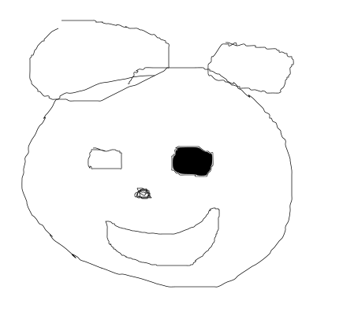
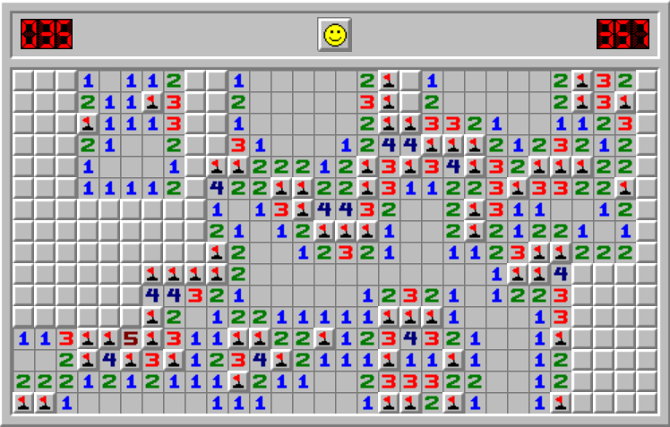

## Goals

- Flood fill use
- Flood fill algorithm
- Flood fill implementation

## Idea

Starting with node $n$ that has _target_ color $c$, change color of all connected nodes of the same color to some _replacement_ color $c'$.

## Use

- Bucket fill tool
- Game board evaluation
- Enclosures counting
- Maze solving

### Bucket fill



### Game board evaluation



### Count enclosed areas

```text
·················***
··*···············**
·***················
··*·················
········***·········
·······*****········
········***·········
··················**
·················***
··················*·
```

## Algorithm

- Recursive or iterative
- Stack or queue
- 4-way or 8-way

### Stack-based recursive

1. If the current node (cell, pixel) color is equal to the _replacement_ $c'$, return
2. If the current node color is **not** equal to _target_, return
3. Update color of the current node to $c'$
4. Continue the algorithm by expanding the flood to the adjacent nodes (NESW)
5. Return

### Queue-based iterative

1. If the current node (cell, pixel) color is equal to the _replacement_ $c'$, return
2. If the current node color is **not** equal to _target_, return
3. Update color of the current node to $c'$
4. Create an empty queue $Q$
5. Add current node $n$ to $Q$
6. Continue while $Q$ is not empty
   1. Dequeue a node $n$ from $Q$
   2. If a neighbor of $n$ has the _target_ color, paint that neighbor $c'$, and add it to the queue
7. Return

## Implementation

- Recursive
- Queue-based on constrained systems
- Rectangle painting
- Right-hand method

## Summary

- Flood fill use
- Flood fill algorithm
- Flood fill implementation

## Thank you

Got questions?

## References

- [Flood fill - Wikipedia](https://en.wikipedia.org/wiki/Flood_fill)
