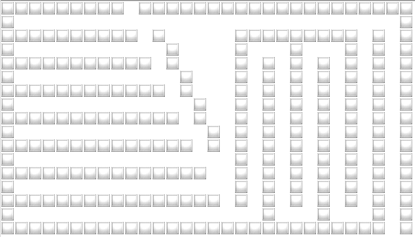
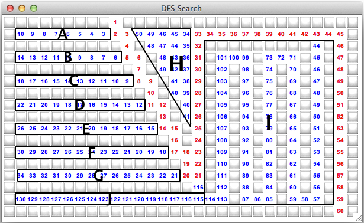
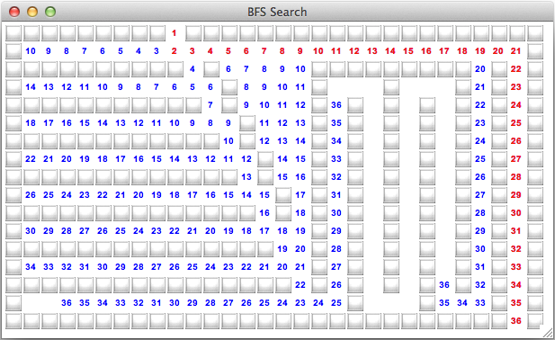
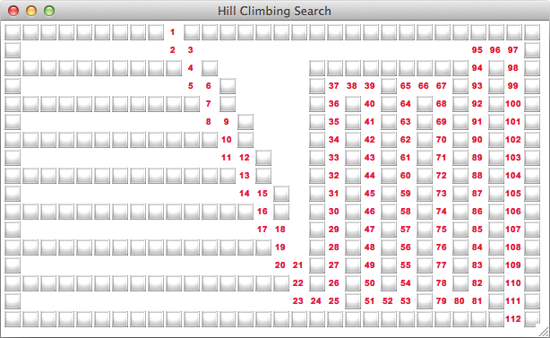
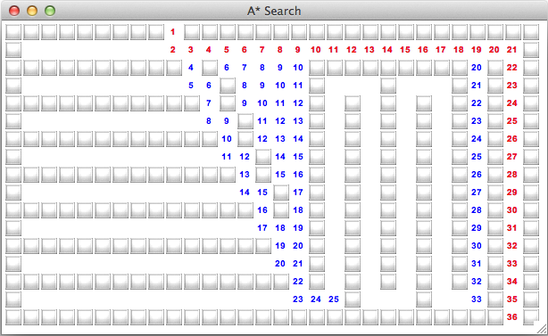

## Goals

* Depth First Search
* Breadth First Search
* Hill Climbing
* Best First Search
* A\* Search

## Problem

* Sometimes the *exact* answer to a question (e.g. search query) is hard to compute
  * $O(n!)$ time complexity
* A *close enough* answer may be preferred
* A *heuristic* helps
  * eliminate possible solutions (branches of the decision tree)
  * prioritize *better* solutions

### Maze search

* Maze is just a graph
* Special representation: `set` of tuples
  * each `tuple` is a (row, column) pair

```python
import namedtuple

Location = namedtuple("Location", ["row", "col"])
```



### Adjacent locations

```python
def adjacent(maze, location):
    [Location(location.row - 1, location.col),
    Location(location.row + 1, location.col),
    Location(location.row, location.col - 1),
    Location(location.row, location.col + 1)]
```

## Depth First Search

* NSWE
* Backtracking
* Stack

### Depth First Search. Example



## Breadth First Search

* NSWE
* Circles
* Queue

### Breadth First Search. Example



## Hill Climbing

* SENW
* Manhattan distance heuristic
* Under-estimate

### Hill Climbing. Example



### Hill Climbing. Properties

* DFS with priority
* A priori knowledge of the goal
* Under-estimate or measure the distance exactly
  * Over-estimation leads to DFS
* Can handle large search spaces and branching
* May not find an optimal solution
  * My suffer from local maxima or peaks

## Best First Search

* Combination of BFS and Hill Climbing
* DFS when moving towards goal
* BFS when moving away from the goal
* Priority queue

### Best First Search. Example


## A\* Search

* Abandon long paths quickly

### A\* Search. Example



## Comparison

| Algorithm | Inf space | Optimal | Data struct | Heuristic | Comment |
|---|---|---|---|---|---|
| Depth first | Poor | Possible | Stack | None | May get lost in an open world
| Breadth first | Good | Always | Queue | None | Depends on branching factor
| Hill climbing | Good | Possible | Stack | Under-estimate | Local max vs global
| Best First | Good | Possible | Heap | Under-estimate | Better than hill climbing
| A\* | Good | Depends | Heap  | Path length | Good enough in many cases

## Summary

* Depth First Search
* Breadth First Search
* Hill Climbing
* Best First Search
* A\* Search

## Thank you

Got questions?

## References

* [Data Structures and Algorithms with Python by Kent Lee and Steve Hubbard](https://dl.acm.org/citation.cfm?id=2732680)
