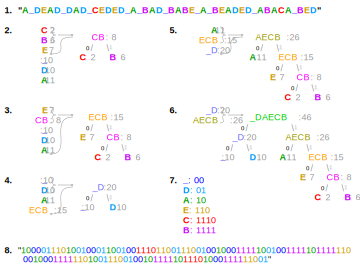

## Goals

* Compression
* Decompression

## Compression

### Build a tree. Node

```python
class Node:
    def __init__(self, letter, weight, left=None, right=None):
        self.letter = letter
        self.weight = weight
        self.left = left
        self.right = right

    def __lt__(self, other):
        return self.weight < other.weight

    def __repr__(self):
        return f"Node({self.letter}, {self.weight}, {self.left}, {self.right})"
```

### Build a tree. Algorithm

* Calculate weight (frequency) of each letter in text
* Turn each letter into a `Node` and add them to a `heap`
  * Lowest frequency (probability) will have the highest priority
* While possible continue the following:
  * pop two nodes from the heap
  * combine them into a new node with the new `weight` as a sum of their `weight`s
  * add new node to the heap
* Stop the process when there is only one node left in the heap
  * This is the `root` of the tree

### Example

```text
A_DEAD_DAD_CEDED_A_BAD_BABE_A_BEADED_ABACA_BED
```

```python
{'A': 11, '_': 10, 'D': 10, 'E': 7, 'B': 6, 'C': 2}
```



### Making codes

* Assign a code (sequence of 0 and 1) to every letter in the tree
* The more frequent is the letter, the shorter is the code

### Making codes. Algorithm

* Start with the `root` of the tree, empty `path`, and an empty dictionary
* If `root` is `None`, stop
* If `root.letter` is not `None`, add it to the dictionary
  * set the value of the letter to the `path`
* Continue recursively
  * mark nodes in the left subtree by adding *0* to the `path`
  * mark nodes in the right subtree by adding *1* to the `path`

## Decompression

* Read a stream of bits
* Traverse the tree until `node.letter` is not `None`
* Continue

## Summary

* Compression
* Decompression

## Thank you

Got questions?

## References

* [Huffman coding - Wikipedia](https://en.wikipedia.org/wiki/Huffman_coding)
* [Huffman, D. (1952). "A Method for the Construction of Minimum-Redundancy Codes](https://www.ic.tu-berlin.de/fileadmin/fg121/Source-Coding_WS12/selected-readings/10_04051119.pdf)
