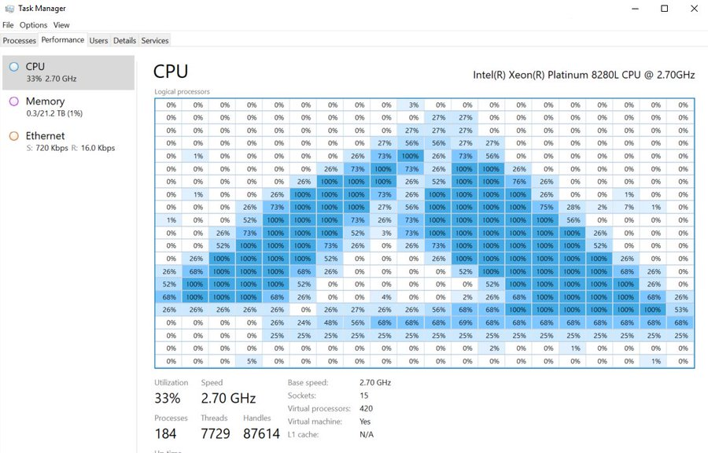

## Goals

* Why bother learning advanced algorithms and data structures
* Why bother learning advanced anything
* Why bother learning
* Why bother
* Why

::: notes

Sometimes standard implementation is too rigid or does not fit the needs of a specific problem. One needs to understand a known data structure or an algorithm in order to use it properly.

:::

## Problem solving

### Basic approach

Almost any problem can be solved using the combination of the following:

* Brute force
* Array
* Infinite time

### See them aliens

### Constrains

* Time
* Processing power
* Storage
* Memory
* Bandwidth

## Algorithms

Algorithms are for people who don't know how to buy RAM.

--Anonymous

### Who needs those fancy algorithms anyway

::: notes

<https://twitter.com/markrussinovich/status/1333723956902121474>

:::

### Basic algorithms

* Linear search
* Binary search
* Selection sort
* Insertion sort
* Breadth first search
* Depth first search
* Greedy algorithms

### Advanced algorithms

* Quick sort
* Merge sort
* Minimax
* Dynamic programming
* Minimum spanning tree
* Shortest path
* Heuristic search

### Very advanced algorithms

Usually involve a fair amount of math

## Data structures

Algorithms + data structures = programs

--Niklaus Wirth

### Data organization

Data storage optimization needs:

* **C**reate / Insert
* **R**etrieve / Query
* **U**pdate
* **D**elete

### Collection data types

* Tuple
* List
* Set
* Dictionary

::: notes

*lists* are basic and versatile

*tuples* are immutable

*sets* are fast

*dictionaries* are awesome

:::

### Basic data structures

* Array
* Stack
* Queue
* Deque
* Linked list
* Doubly-linked list
* Circular list
* Doubly-linked circular list

::: notes

*arrays* are basic and versatile

*stacks* are used to simulate recursion, process function calls, DFS

*queues* are used in simulations, BFS

*linked lists* are fast for insertion and removal

:::

### Advanced data structures

* Set
* Map
* Partition
* Tree
* Heap
* Balanced tree
* Trie
* Graph

::: notes

*heaps* are also known as *priority queues* and used in Dijkstra's and other *greedy* algorithms

*sets* are used to check membership, find $k$-th largest, items smaller then the given one

*maps* are used in *dynamic programming*

:::

### Very advanced data structures

* Van Emde Boas tree
* Judy array
* Probabilistic data structures

## Algorithms + data structures = programs

Almost any solution can be *improved* using the combination of the following:

* Proper algorithm
  * more efficient
  * more specific
  * constraint-aware
* Appropriate data structure
  * more efficient
  * yet feasible

## Human vs machine

* Machine is *stupid*
* Human is *smart*

## Computational complexity

### Asymptotic notation

* Asymptotic *upper* bound: Big-O
* Asymptotic *lower* bound: Big-$\Omega$
* Asymptotic *tight* bound: Big-$\Theta$
* Amortized complexity

### Big-O

$O(g(n)) = \{f(n) | \exists k > 0, n_0 \in Z^+ \ni 0 \le f(n) \le k \times g(n), \forall n \ge n_0\}$

### Big-$\Omega$

$\Omega(g(n)) = \{f(n) | \exists k > 0, n_0 \in Z^+ \ni 0 \le k \times g(n) \le f(n), \forall n \ge n_0\}$

### Big-$\Theta$

$\Theta(g(n)) = {} \{f(n) | \exists k_1, k_2 > 0, n_0 \in Z^+ \ni 0 \le k_1 \times g(n) \le f(n) \le k_2 \times g(n), \forall n \ge n_0\}$

### Why does it matter

Algorithm evaluation and comparison

### Unsolvable (?) mysteries

$P = NP$

$P \ne NP$

### P =? NP

::: notes

$P$ - solvable in polynomial time

$NP$ - verifiable in (nondeterministic) polynomial time

$NP-complete$ - set of problems to which other $NP$ can be reduced in polynomial time

$NP-hard$ - at least as hard as any $NP$ but he solution doesn't need to be verifiable

:::

## Summary

* Basic algorithms
* Advanced algorithms
* Basic data structures
* Advanced data structures
* Computational complexity

## Thank you

Got questions?

## References

* [Algorithms by Dasgupta et al](https://dl.acm.org/citation.cfm?id=1177299)
* [Algorithms + Data Structures = Programs by Niklaus Wirth](https://dl.acm.org/citation.cfm?id=540029)
* [Data Structures and Algorithms by Alfred Aho et al](https://dl.acm.org/citation.cfm?id=577958)
* [Data Structures and Algorithms in Python by Goodrich et al](https://dl.acm.org/citation.cfm?id=2500912)
* [Data structures and algorithms with object-oriented design patterns in C++ by Bruno Preiss](https://dl.acm.org/citation.cfm?id=289373)
* [Data Structures and Algorithms with Python by Kent Lee and Steve Hubbard](https://dl.acm.org/citation.cfm?id=2732680)
* [A Discipline of Programming by Edsger Dijkstra](https://dl.acm.org/citation.cfm?id=550359)
* [Introduction to Algorithms by Thomas Cormen et al](https://dl.acm.org/citation.cfm?id=1614191)
* [Problem Solving with Algorithms and Data Structures Using Python by Brad Miller and David Ranum](https://dl.acm.org/citation.cfm?id=2073661)
