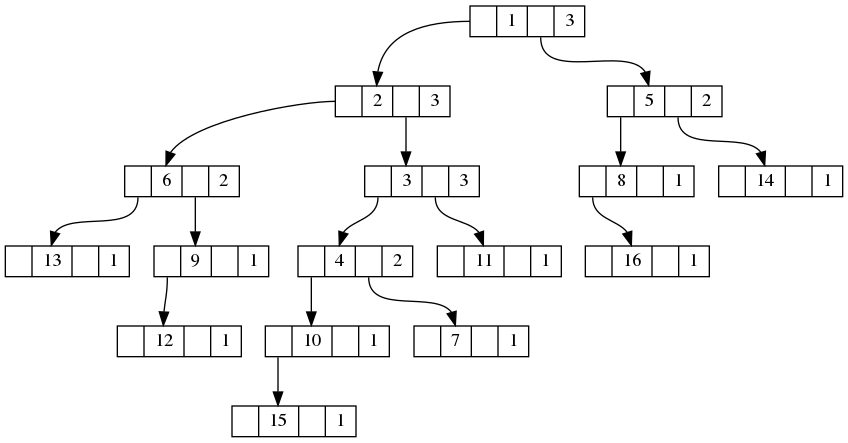
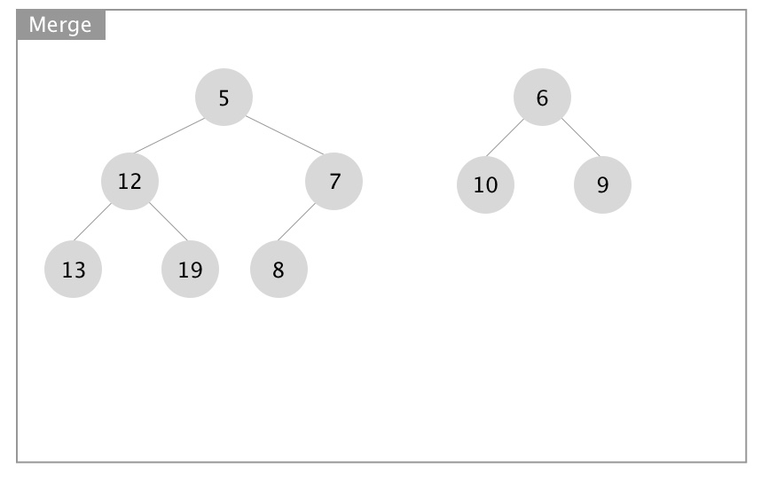
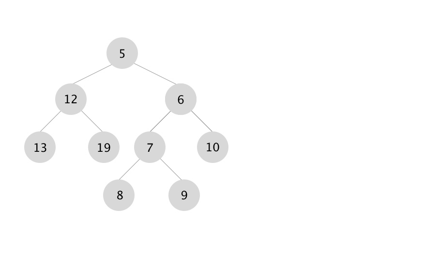

## Goals

* Leftist heap definition
* Leftist heap implementation
* Merging
* Insertion
* Removal

## Leftist heap ADT

### Leftist


### Leftist heap (tree)



### Leftist tree properties

* Invented in 1972 by Clark Crane
* Binary tree with left subtree **usually** taller than the right one
* Merging of two heaps is $O(log(n))$ (improvement over *binary heap*'s $O(n)$)
* Every node keeps track of the *s-value* (null path length)
* The shortest path to an external node is always on the right

## Leftist tree definition

1. Either $T=\emptyset$; or
2. $T={R,T_L,T_R}$, where $T_L$ and $T_R$ are leftist trees which have *s-value* $d_L$ and $d_R$, such that $d_L \ge d_R$

## Leftist heap vs leftist tree

Leftist heap is a heap-ordered leftist tree

Rule #2 may be violated after the insertion, that is *s-value* of the right subtree of a certain node may become larger than the *s-value* of the left subtree

In that case, swap left and right subtrees of the node

## Implementation

Implemented with links (pointers), based on `BinaryTree`

### Class BinaryTree
```python
class BinaryTree:
    """Binary tree class"""

    def __init__(self, key):
        self._key = key
        self._child_left = None
        self._child_right = None
```

### Class LeftistHeap

```python
class LeftistHeap(BinaryTree):
    """Leftist tree class"""

    def __init__(self):
        super().__init__(None)
        self._svalue = 0
```

## Merging leftist heaps

Merging heaps `h1` and `h2` keeps `h1` *leftist* and `h2` empty

1. If `h1` is empty, swap `h1` and `h2`
2. Assume the *root* of `h2` is greater than *root* of `h1`
3. Recursively merge `h2` with the **right** subtree of `h1`
4. Swap left and right subtrees if *s-value* constrain is violated
5. If the *root* of `h2` is smaller than the *root* of `h1`, swap and proceed

$O(log(n))$ operation

### Merging example start



### Merging example result



## Insertion

In order to insert an element `e` into leftist heap `h`, create a new leftist heap of one element (`e`) and merge it into `h1`

## Removal

In order to remove an element from the leftis heap `h`, remove its root and merge left and right subtrees into a new leftist heap.

## Summary

* Leftist heap definition
* Leftist heap implementation
* Merging
* Insertion
* Removal

## Thank you

Got questions?

## References

* [Data Structures and Algorithms with Python by Kent Lee and Steve Hubbard](https://dl.acm.org/citation.cfm?id=2732680)
* [Leftist tree - Wikipedia](https://en.wikipedia.org/wiki/Leftist_tree)
* [Weight-biased leftist trees and modified skip lists](https://www.cise.ufl.edu/~sahni/papers/wblt.pdf)
