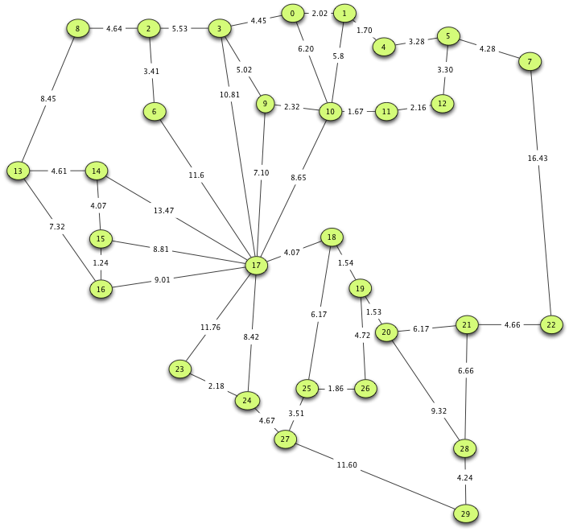
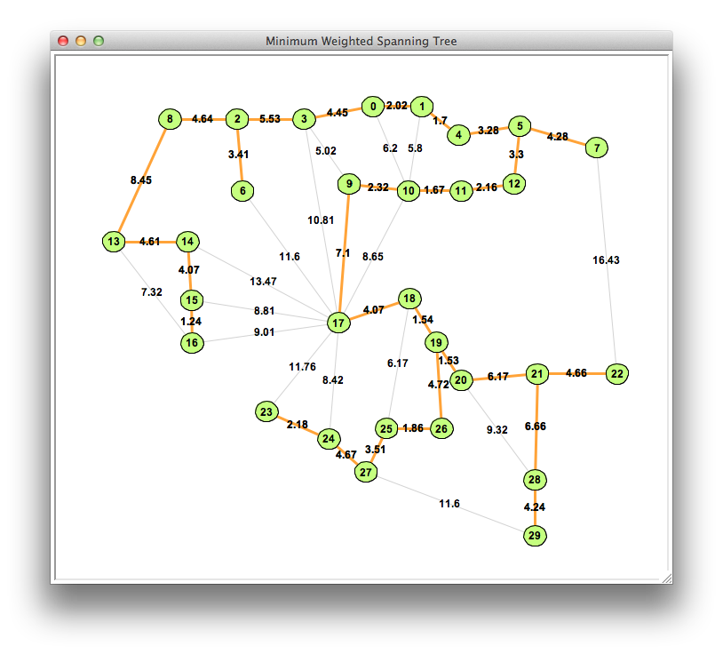

## Goals

* Problem
* Kruskal's algorithm
* Prim's algorithm

## Problem

Find **a** tree $T$ (or forest) that includes all vertices in a graph $G$, where the weight of edges $\sum{W_E}$ is minimal

Connecting cities, interesections etc.

### Northeast Iowa



### Northeast Iowa MST



## Kruskal's algorithm. General information

* Invented in 1956 by Joseph Kruskal
* Works well with any graph
* Greedy algorithm

## Kruskal's algorithm

1. Create a forest $F$, where each graph vertex $V$ is a separate tree
   * $F$ can be represented as a list of sets (initially, each `set` contains 1 vertex)
2. Add every graph edge $E$ to a collection $C$
3. Repeat the following steps while $C$ is not empty and $F$ is not complete (spanning)
    * remove the minimum weight edge $E_{min}$ from $C$
    * if $E_{min}$ connects two different trees (`sets`), add it to the forest $F$ and form a new `set` from the union of the previous two

### Challenges and solutions

* Sort vs heap
* Merging sets
  * Set vs Partition

## Partition

### Definition

A list of integers with one entry for each vertex. If keys are numbers $0..n$, the initial list contains those numbers matching their indices.

```python
[0, 1, 2, 3, 4, 5]
```

The list is a collection of trees where a vertex is a root if the value matches its index. Instead of merging sets, a $O(|V|^2)$ operation, we could merge trees, a $O(\log{|V|})$ operation.

### Tree merging

* Consider edge $E(S,D)$ connecting vertices $S$ and $D$.
* If those vertices are in different trees
  * add the edge to the forest $F$
  * update the root of the tree that contains $D$ to be the root of the tree that contains $S$

## Prim's algorithm

* Greedy algorithm for finding MST
* Builds MST starting with an arbitrary vertex
* Works well on sparse, connected graphs

### History

* Developed in 1930 by Czech mathematician Vojtěch Jarník and later rediscovered Robert Prim in 1957 and Edsger Dijkstra in 1959
* Alternative names:
  * Jarník's algorithm
  * Prim–Jarník algorithm
  * Prim–Dijkstra algorithm
  * DJP algorithm

### Description

1. Pick a vertex and make it a root of the tree
2. Find the shortest edge that connects the tree to a vertex outside of the tree
3. Add that edge (and the vertex it connects) to the tree
4. Repeat until the tree is complete (spanning all vertices)
5. Repeat to build a forest

### Time complexity

$O((|V|+|E|)log{|V|})=O(|E|log{|V|})$, assuming *binary heap* is used.

## Summary

* Problem
* Kruskal's algorithm
* Prim's algorithm

## Thank you

Got questions?

## References

* [Data Structures and Algorithms with Python by Kent Lee and Steve Hubbard](https://dl.acm.org/citation.cfm?id=2732680)
* [Kruskal's algorithm - Wikipedia](https://en.wikipedia.org/wiki/Kruskal%27s_algorithm)
* [Prim's algorithm - Wikipedia](https://en.wikipedia.org/wiki/Prim%27s_algorithm)
* [BSTJ 36: 6. November 1957: Shortest Connection Networks And Some Generalizations. (Prim, R.C.) : Free Download, Borrow, and Streaming : Internet Archive](https://archive.org/details/bstj36-6-1389)
