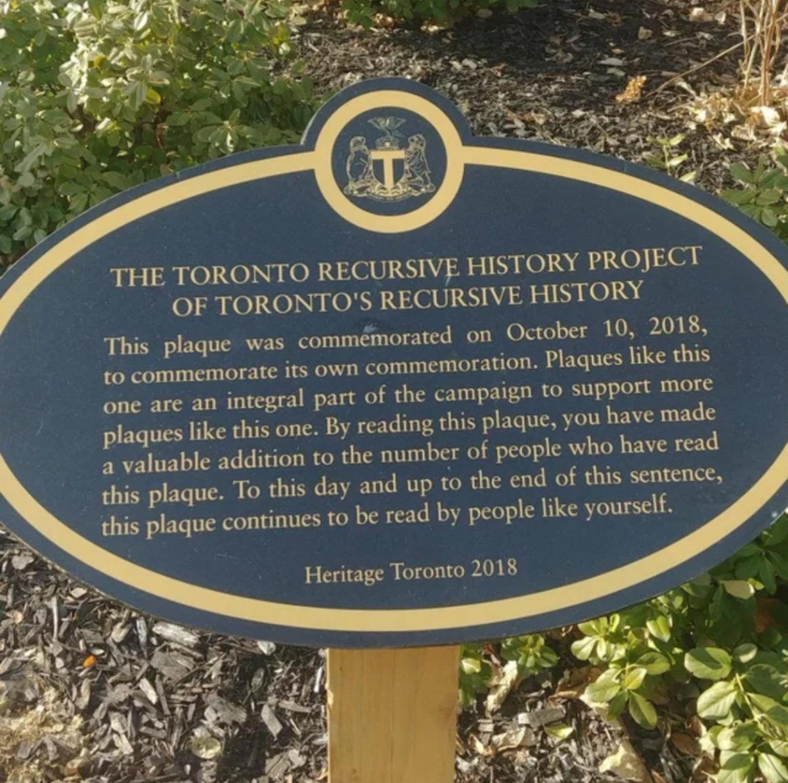

## Goals

* Understand recursion
* Embrace recursion
* Avoid recursion

## Recursion

## Laws of recursion

* Function calling itself
* Base case(s)
* Approach the base case

## Summary

* Recursion is recursive

## Thank you

Got questions?

## References

* [Data Structures and Algorithms with Python by Kent Lee and Steve Hubbard](https://dl.acm.org/citation.cfm?id=2732680)
