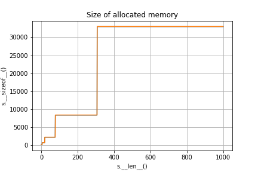
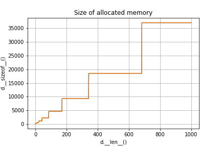

## Goals

* Set as HashSet
* Map as HashMap
* Memoization

## Set

An unordered collection of unique elements

### Set properties

* Cardinality (number of items)
* Load factor

### Set operations (item)

* add (new_member)
* discard (or do nothing)
* pop (random member)
* remove (member)

### Set operations (another set)

* difference
* intersection
* isdisjoint
* issubset
* issuperset
* symmetric_difference
* union
* update

### Set implementation

* Hashing
* Why can't we have a set of lists?
* What happens if there is a collision?
* What happens is an item is removed?

### Python set

```python
import sys
for n in range(1000):
    s = {x for x in range(n)}
    print(len(s), sys.getsizeof(s))
```



## Map

Very similar to sets

### Map properties

`key`-`value` pairing

### Map implementation

Parallel lists

### Python dictionary

```python
import sys
for n in range(1000):
    d = {x: x for x in range(n)}
    print(len(d), sys.getsizeof(d))
```



## Memoization

Store the results of a function called with the same arguments

### Naive Fibonacci

Chokes around `n=40`

```python
def fib(n):
    if n < 1:
        return 0
    if n == 1:
        return 1
    return fib(n - 1) + fib(n - 2)
```

### Fibonacci with memory

Handles large `n` without any delay, the only limiting factor is the recursion depth (1000 by default)

```python
from functools import lru_cache

@lru_cache(100)
def fib(n):
    if n < 1:
        return 0
    if n == 1:
        return 1
    return fib(n - 1) + fib(n - 2)
```

## Summary

* Set as HashSet
* Map as HashMap
* Memoization

## Thank you

Got questions?

## References

* [Data Structures and Algorithms with Python by Kent Lee and Steve Hubbard](https://dl.acm.org/citation.cfm?id=2732680)
* [How Python implements dictionaries | Jessica Yung](http://www.jessicayung.com/how-python-implements-dictionaries/)
* [cpython/dictobject.c at master · python/cpython](https://github.com/python/cpython/blob/master/Objects/dictobject.c)
