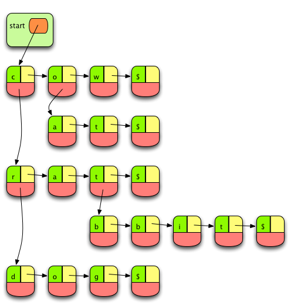

## Overview

* Properties
* Implementation
* Advantages

## Properties

* Fast re*trie*val
* Cannot be used if removal is necessary
* Works the best if keys are composite and there is overlap between them (e.g. spell checker)

## Example

::: notes

Figure 8.4 (p.210)

:::

## Implementation

* Arrays of arrays (matrix)
  * Could be sparse
* Linked list of linked lists
  * Not sparsely populated

### Implementation using linked lists

* Key (character)
* Next (character in the same position)
* Follows (character in the following position)

### Insertion

* Iterative or recursive
* Build a list of lists

## Comparison to Bloom filter

* Bloom filter is (usually) faster
* Bloom filter is smaller
* Trie can offer alternatives
  * Transposition of characters (*the* vs *teh*)
  * Missing characters (*there* vs *ther*)
  * Extra characters (*squirrel* vs *squirrell*)
  * Character replacement (*kiwi* vs *kivi*)
* No false *positives* or *negatives* in a trie

## Summary

* Tries are good

## Thank you

Got questions?

## References

* [Data Structures and Algorithms with Python by Kent Lee and Steve Hubbard](https://dl.acm.org/citation.cfm?id=2732680)
