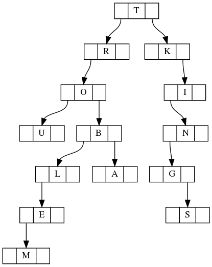

# Tree traversal

Implement function `get_preorder` that takes the results of *in-order* and *post-order* tree traversals and returns its *pre-order* traversal.

Your implementation must be properly formatted and pass the tests.

Here is an example of a tree with the following traversals:

* PREORDER: "TROUBLEMAKINGS"
* INORDER: "UOMELBARTKGSNI"
* POSTORDER: "UMELABORSGNIKT"

It's guaranteed that the word is an [isogram](https://en.wikipedia.org/wiki/Isogram)
